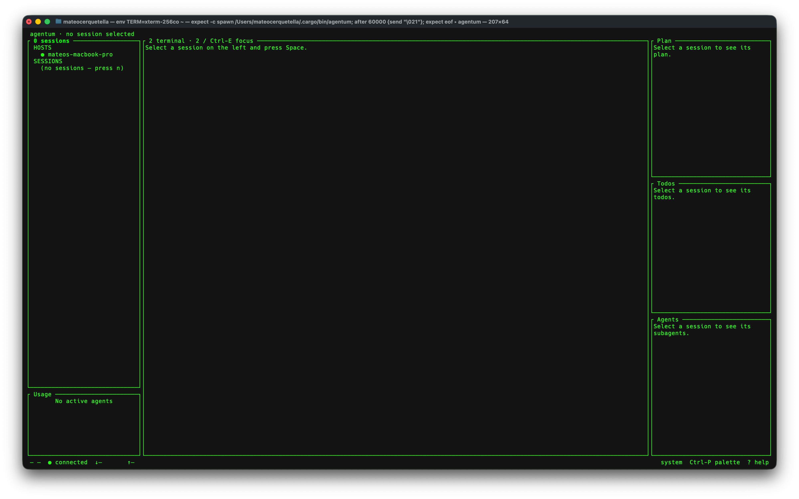

# agentum

A terminal UI for running and supervising AI coding agents in tmux.



## Install

Requires Rust 1.85+ and `tmux`.

```sh
cargo install --path crates/agentum-tui --locked --force
```

Then run:

```sh
agentum
```

Press `?` for help, `Ctrl-P` for the command palette, and `Ctrl-Q` to quit.

## License

MIT
